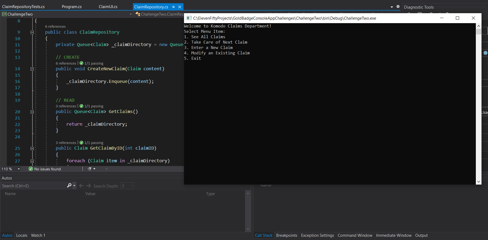

# Gold Badge Console App Challenges

## How To Download

Feel free to clone and test the console!!

1. First, since this is a C# project, make sure you have Visual Studio Community downloaded on a Windows computer or bootcamped Mac
2. Click green "Code" button with dropdown list
3. Copy the GitHub link
4. Open your terminal
5. Navigate to the directory you'd like to clone the project
6. Once in directory, type "git clone" then paste the URL you copied in step 2
7. Press enter and your local clone will be created

## How To Run

Once cloned, have some fun and play around with the console apps!

1. Open cloned project in Visual Studio Community
2. Choose between Challenge One, Challenge Two, or Challenge Three to start first. 
>>> I recommend starting with Challenge One assembly
3. Once you have the assembly open, head to the icon bar at the top of VS Community
4. Look for the drop down menu and choose which assembly you decided to start with
5. Once you have chosen, press the "Start" button directly next to the dropdown
6. Your console app should open and then follow the menu prompts
>>> Console may take a minute or two to load
7. HAVE FUN!!

## What To Expect

### Challenge One

Yum, yum!

Challenge One presents the user with the ability to manage a food menu.

You will be able to: 
>> Create new menu items
>> Update existing menu items
>> List all menu items

### Challenge Two

Safety first!

Challenge Two presents the user with the ability to manage insurance claims.

You will be able to: 
>> See all claims
>> Take care of next claim in the queue
>> Enter a new claim
>> Update an existing claim

### Challenge Three

Let's talk about security!!

Challenge Three presents the user with the ability to manage badges that have access to doors.

You will be able to:
>> Create a new badge with a badge ID and give access to doors
>> Update an existing badge by badge ID
>>>>> Remove access to a door 
>>>>> Add access to a door
>> List all badges with ID and door access
